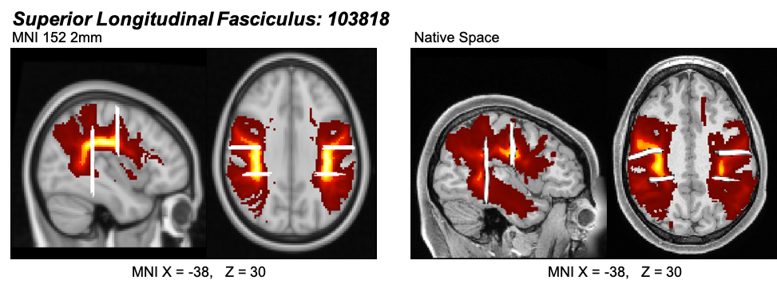

```{r setup, include=FALSE}
knitr::opts_chunk$set(echo = TRUE)
```
## Section 1: Overview
In this document, we briefly describe the HCP D-MRI data and the steps to download D-MRI data from HCP database, the D-MRI data preprocessing, FOD estimation, tractography and feature extraction. 


## Section 2: Data

### Section 2.1: HCP D-MRI data
The [*WU-Minn Human Connectome Project (HCP)*](http://www.humanconnectomeproject.org/) has eddy current-corrected 3T D-MRI data of 1206 healthy young adults (Age: 22 ~ 35) from 457 unique families. D-MRI data is obtained under 3 different b-values (1,000$s/mm^2$, 2,000$s/mm^2$, 3,000$s/mm^2$) on  a $145 \times 174 \times 145$ 3D grid  with voxel resolution $1.25 \times 1.25 \times 1.25 mm^3$. For each b-value, 90 gradient directions and 6 $b_0$ images are available. 


### Section 2.2: HCP D-MRI data download
**Step 1**: Obtain ***AWS* access credential** -- *access key id* and *secret key*: Login  [*ConnectomeDB*](https://db.humanconnectome.org/app/template/Login.vm) account and then click the **Amazon S3 Access Enabled** box. If you do not have an account, you need to first create one. 


**Step 2**: Install the [*neurohcp* R package](https://neuroconductor.org/package/neurohcp) for batch downloading from *ConnectomeDB*.

**Step 3**: Obtain subject ID using the **hcp_1200_scanning_info** function in the *neurohcp* package. 

```{r eval=FALSE}
library(neurohcp)
set_aws_api_key(access_key = "your_access_key", secret_key = "your_secret_key")
hcp_info=hcp_1200_scanning_info # information of the database
hcp_id=hcp_info$id #ID of available subjects
```

Two functions are used to download data from *ConnectomeDB*: 

 - **download_hcp_dir**: To download all files in a certain directory
 
 - **download_hcp_file**: To download a certain file
 
For each subject, the following files (approximately, 1.5GB) are relevant to our analysis:

- *T1w_acpc_dc_restore_1.25.nii.gz*: T1w image (structural volume sampled at the same resolution as the diffusion data)
- *data.nii.gz*: diffusion weighted image 
- *bvecs*: gradient directions
- *bvals*: b-values
- *nodif_brain_mask.nii.gz*: T2w extracted brain mask


```{r eval=FALSE}
## Download D-MRI directory of a subject
# "100307" is the subject ID; an output directory should also be specified: default: tempfile()
download_hcp_dir("HCP/100307/T1w/Diffusion",verbose=FALSE, outdir="user_path")  

## Downlaod the T1w image of a subject
# an output file path/name should also be specified: default: NULL
download_hcp_file("HCP/100307/T1w/T1w_acpc_dc_restore_1.25.nii.gz", verbose = FALSE,
                  destfile="user_path/out_file_name") 
```


**Notes:** Sometimes, the files of a subject found through **hcp_1200_scanning_info** could not be downloaded through either **download_hcp_dir** or **download_hcp_file** function. This problem occurs due to one of the two reasons:

* Data of this subject have not been registered on *ConnectomeDB*.
* Data have not been registered with proper directory path, even though the data are available on *ConnectomeDB*. 

You can check whether data of a subject are available on *ConnectomeDB* by using the **hcp_list_dirs** function:  If the result from **hcp_list_dirs** does not have any value in *parsed_result$Contents$Key[[1]]*, it means that you will have to manually check the availability of files.

```{r eval=FALSE}
dir_info=hcp_list_dirs(paste0("HCP/100307/T1w/Diffusion"))

#Check whether D-MRI can be downloaded thorugh the "download_hcp_dir" function.
is.null(dir_info$parsed_result$ListBucketResult$Contents$Key[[1]]) 
 
```

## Section 3: HCP D-MRI Data Preprocessing
This section describes how to process D-MRI data from the [Human Connectome Project (HCP) database](https://db.humanconnectome.org/app/template/Login.vm;jsessionid=667157DA4C04EFC913CB176700EA35E5).  We use [**FSL**](https://fsl.fmrib.ox.ac.uk/fsl/fslwiki/), a library of tools for MRI, fMRI and D-MRI imaging data, as well as its R wrapper, the *fslr* R package from [*neuroconductor*](https://neuroconductor.org/package/fslr). Both **FSL** and *fslr* need to be [installed](https://fsl.fmrib.ox.ac.uk/fsl/fslwiki/FslInstallation). 


```{r eval=FALSE}
library(fslr)
```

**Notes:** Processing time is measured under a Xeon 72 core, 2.3GHz, 256GB RAM linux server.

### Step 0 -- HCP Preprocessing Pipeline
D-MRI data from HCP database have already been (minimally) processed. The detailed information about the HCP minimal preprocessing pipeline can be found in [Glasser et al. 2013](https://doi.org/10.1016/j.neuroimage.2013.04.127) and on page 133 of the [HCP  reference manual](https://www.humanconnectome.org/storage/app/media/documentation/s1200/HCP_S1200_Release_Reference_Manual.pdf). The scripts are available at [HCPpipelines git repository](https://github.com/Washington-University/HCPpipelines/tree/master/DiffusionPreprocessing).

These steps include: 

 1. Intensity normalization 
 2. EPI distortion correction (*TOPUP* algorithm in **FSL**) 
 3. Eddy current correction (*EDDY* algorithm in **FSL**) 
 4. Gradient nonlinearity correction 
 5. Registration (6 DOF rigid body) of the mean b0 image (T2-weighted image) to native volume T1-weighted image by **FSL** *FLIRT BBR* and **FreeSurfer** *bbregister* algorithms; and the transformation of diffusion data, gradient deviation, and gradient directions to the 1.25mm
*structural space (T1w space)*. Moreover, (T1w co-registered) T2w extracted brain mask *'nodif_brain_mask.nii.gz'* by **FSL** *BET* algorithm is also provided. 

Thus, the HCP D-MRI data have already been *co-registered* to the structural (T1w) space.  In the following, we are going to focus on segmentation based on T1 weighted image and registration of T1 weighted image onto the standard space (MNI152_T1) through **FSL** *FAST* segmentation algorithm and *FLIRT/FNIRT* registration algorithms, respectively. 

### Step 1 -- T1w Brain Extraction
**This step takes a few seconds per image**. 

The original T1w and D-MRI images contain both skull and the brain.  The [*BET*](https://fsl.fmrib.ox.ac.uk/fsl/fslwiki/BET) ([Smith 2002](https://onlinelibrary.wiley.com/doi/pdf/10.1002/hbm.10062)) algorithm in **FSL** can be used to extract brain from original images, which deletes non-brain tissues from an image of the whole head.
In particular, extracted T1w images are needed for segmentation and registration. We use the (co-registered) T2w extracted brain mask provided by HCP preprocessing pipeline (*'nodif_brain_mask.nii.gz'*) and apply that to the T1 image to create a T1w extracted brain. The rationale to use T2w extracted brain mask is because T2w image provides better contrasts between brain tissues and non-brain tissues. 


[**Apply T2w extracted brain mask to T1w**](https://www.fmrib.ox.ac.uk/primers/intro_primer/ExBox14/IntroBox14.html) 

Here we use the *fslmaths* tool to multiply a binary mask (the T2w extracted brain mask *'nodif_brain_mask.nii.gz'*) with an image (the original T1w image *'T1w_acpc_dc_restore_1.25.nii.gz'*).

The following is the shell code: 
```{bash eval=FALSE}
fslmaths "/user_path/T1w_acpc_dc_restore_1.25.nii.gz" -mul
"/user_path/nodif_brain_mask.nii.gz"
"/user_path/T1w_acpc_dc_restore_1.25_brain.nii.gz"
```

The following is the corresponding R wrapper function: 
```{r eval = FALSE}
bet_w_fslmaths<-function(T1w, mask, outfile, intern=FALSE, verbose=TRUE, retimg=T, ...){
  cmd <- get.fsl()
  if (retimg) {
    if (is.null(outfile)) {
      outfile = tempfile()
    }
  } else {
    stopifnot(!is.null(outfile))
  }
  T1w = checkimg(T1w, ...)
  mask = checkimg(mask, ...)
  outfile = checkimg(outfile, ...)
  outfile = nii.stub(outfile)
  cmd <- paste0(cmd, sprintf("fslmaths \"%s\" -mul \"%s\"  \"%s\"", 
                             T1w, mask, outfile))
  if (verbose) {
    message(cmd, "\n")
  }
  res = system(cmd, intern = intern)
  ext = get.imgext()
  outfile = paste0(outfile, ext)
  return(res)
}
```
Usage:
```{r eval = FALSE}
bet_w_fslmaths(T1w = paste0(user_path,'T1w_acpc_dc_restore_1.25.nii.gz'),
               mask = paste0(user_path,'nodif_brain_mask.nii.gz'), 
               outfile = paste0(user_path,'T1w_acpc_dc_restore_1.25_brain.nii.gz'))
```


### Step 2 -- White Matter Segmentation 
**This step takes ~ 4 minutes per image**. 


[**FAST segmentation**:](https://fsl.fmrib.ox.ac.uk/fsl/fslwiki/FAST)
The *FAST* algorithm ([Zhang et al. 2001](https://ieeexplore.ieee.org/document/906424)) classifies each voxel in the brain into different tissue types (e.g. CSF -- cerebrospinal fluid, GM -- grey matter, WM -- white matter) from various image sources (e.g., T1w, T2w). Since T1w images provide better contrasts between white matter and grey matter,   we apply *FAST* to the T1w extracted brain (*'T1w_acpc_dc_restore_1.25_brain.nii.gz'*) from Step 1.

```{r eval=FALSE}
fast(file = paste0(user_path,'T1w_acpc_dc_restore_1.25_brain.nii.gz'), 
     outfile = nii.stub(paste0(user_path,'T1w_acpc_dc_restore_1.25_brain.nii.gz')), 
     opts = '-N')
```

**Outputs from *FAST* **:

* 'T1w_acpc_dc_restore_1.25_brain_seg.nii.gz': binary segmentation (all classes in one image): e.g. 1 -- CSF, 2 -- GM, 3 --WM if the input is T1w image with 3 classes.

* 'T1w_acpc_dc_restore_1.25_brain_pve*.nii.gz': one partial volume image  for each class (pve0 -- CSF, pve1 -- GM, pve2 -- WM,  if the input is T1w image with 3 classes).  Each voxel has a value between 0 and 1 representing the proportion of tissue in the corresponding class. 

**White matter mask** is  created  by binarising the white matter partial volume image ('T1w_acpc_dc_restore_1.25_brain_pve2.nii.gz') where voxels with positive white matter partial volume are included in the white matter mask.


### Step 3 -- [Subject to Standard Space Registration](https://www.fmrib.ox.ac.uk/primers/intro_primer/ExBox17/IntroBox17.html)
In this step, the T1w image is registered to a standard space (here the [T1-weighted MNI template MNI152_T1](http://nist.mni.mcgill.ca/?page_id=714)). We will apply linear registration by the *FLIRT* algorithm to register T1w to MNI152_T1, followed by the nonlinear registration by the *FNIRT* algorithm. 
Both brain extracted and non-extracted MNI152 template images are provided in the folder *'/usr/local/fsl/data/standard/'*.


[**Step 3.1 FLIRT**:](https://fsl.fmrib.ox.ac.uk/fsl/fslwiki/FLIRT) 

**This step takes ~10 seconds per image**.


The linear registration tool *FLIRT* in **FSL** can perform both intra- (6 DOF) and inter-modal (12 DOF) brain image intensity-based registration. *FLIRT* takes extracted brain images as input and reference, respectively. 

```{r eval=FALSE}
flirt(infile = paste0(user_path,'T1w_acpc_dc_restore_1.25_brain.nii.gz'),
      reffile = '/usr/local/fsl/data/standard/MNI152_T1_2mm_brain.nii.gz',
      omat = paste0(user_path,'org2std.mat'),
      dof = 12,
      outfile = paste0(user_path,'T1w_acpc_dc_restore_1.25_brain_flirt12.nii.gz'))
```

[**Step 3.2 FNIRT**:](https://fsl.fmrib.ox.ac.uk/fsl/fslwiki/FNIRT)

**This step takes ~ 4.5 minutes per image**. 

The nonlinear registration tool *FNIRT* in **FSL**  can only register images of the same modality. Hence we  will need to first register the T1w image to the T1w MNI template (MNI152_T1). We also need to initialize the nonlinear registration  by a linear (12 DOF) registration to get the orientation and size of the image close enough for the nonlinear registration. Therefore, we need to first run the linear registration tool *FLIRT*. 
Moreover, *FNIRT* uses the original image instead of the brain extracted version for both input and reference, so that any errors in brain extraction do not influence the local registration.

Specifically, *FNIRT*  takes the transformation matrix (*'org2std.mat'* specified in '--aff') from  *FLIRT* output  (Step 3.1: affine transformation with 12 DOF),  the original T1w image, and non brain extracted (i.e., with skull) MNI152_T1 template. 

```{r eval=FALSE}
opt_fnirt=paste0(' --aff=', user_path, 'org2std.mat',  
                 ' --config=/usr/local/fsl/etc/flirtsch/T1_2_MNI152_2mm.cnf',
                 ' --cout=', user_path, 'org2std_coef.nii.gz',  
                 ' --fout=', user_path, 'org2std_warp.nii.gz')  

fnirt(infile = paste0(user_path, 'T1w_acpc_dc_restore_1.25.nii.gz'),
      reffile = "/usr/local/fsl/data/standard/MNI152_T1_2mm.nii.gz",
      outfile = paste0(user_path, 'T1w_acpc_dc_restore_1.25_fnirt.nii.gz'),
      opts = opt_fnirt)
```

**Outputs from *FNIRT*:** 

* 'T1w_acpc_dc_restore_1.25_fnirt.nii.gz': the transformed image. 

* --cout 'org2std_coef.nii.gz': the spline coefficient and a copy of the affine transform.

* --fout 'org2std_warp.nii.gz': actual warp-field in the x,y,z directions.


### Step 4 -- [From Standard Space to Native Space](https://fsl.fmrib.ox.ac.uk/fslcourse/lectures/practicals/registration/index.html#applying) 
In Step 3, we conduct registration which transforms an image to a standard template space. Here, we derive the inverse transformation from a standard space to a native space. This is useful for moving masks from a standard space template to the native space. We will use the *invwarp* and *applywarp* functions in **FSL**. 

**Step 4.1 Invert a transformation by *invwarp***

**This step takes ~ 1 minute per image.**

Suppose we want to invert the  *warp-field*  (*'org2std_warp.nii.gz'*) from the *FNIRT* registration output. Then the original T1w image *'T1w_acpc_dc_restore_1.25.nii.gz'* is used as reference and the output is stored in *'std2org_warp.nii.gz'*. The following is the shell code:

```{r eval=FALSE}
invwarp(reffile=paste0(user_path,'T1w_acpc_dc_restore_1.25.nii.gz'),
        infile=paste0(user_path,'org2std_warp.nii.gz'),
        outfile=paste0(user_path,'std2org_warp.nii.gz'))
```


The following is the corresponding R wrapper function: 
```{r eval=FALSE}
invwarp<-function (reffile, infile, outfile, intern=FALSE, opts='', verbose=TRUE, retimg=T, ...) 
{
  cmd <- get.fsl()
  if (retimg) {
    if (is.null(outfile)) {
      outfile = tempfile()
    }
  }
  else {
    stopifnot(!is.null(outfile))
  }
  infile = checkimg(infile, ...)
  reffile = checkimg(reffile, ...)
  outfile = checkimg(outfile, ...)
  outfile = nii.stub(outfile)
  cmd <- paste0(cmd, sprintf("invwarp --ref=\"%s\" --warp=\"%s\" --out=\"%s\" %s", 
                             reffile, infile, outfile, opts))
  if (verbose) {
    message(cmd, "\n")
  }
  res = system(cmd, intern = intern)
  ext = get.imgext()
  outfile = paste0(outfile, ext)
  
  return(res)
}
```

**Step 4.2: Apply a transformation to an image by *applywarp***

**This step takes ~ 10 seconds per image.**

Suppose we want to move a mask on a template space to the native space. The following is the shell code: 
```{r eval=FALSE}
fsl_applywarp(infile = paste0(user_path,'mask_on_template.nii.gz'),
              reffile = paste0(user_path,'T1w_acpc_dc_restore_1.25.nii.gz') ,
              outfile = paste0(user_path,'mask_on_original_space.nii.gz'),
              warpfile = paste0(user_path,'std2org_warp.nii.gz'))
```

In the following, we first chose the  *Superior Longitudinal Fasciculus (SLF)* masks (probabilistic masks on two hemispheres: *SLF_L* -- 41694 voxels, *SLF_R* -- 38386 voxels; brighter color corresponds to higher probability of being on *SLF*) according to the *JHU White-Matter Tractography Atlas* ([Wakana et al. 2007](https://www.ncbi.nlm.nih.gov/pmc/articles/PMC2350213/), [Hua et al. 2008](https://www.ncbi.nlm.nih.gov/pmc/articles/PMC2724595/)) on the *MNI152_T1_2mm* template space (left panel) using [**FSLeyes**](https://fsl.fmrib.ox.ac.uk/fsl/fslwiki/FSLeyes). 
We then mapped these masks  back to the native T1w space of one HCP subject (right panel) using the *applywarp* function. 
We will later use these masks as both *seeding and terminating masks* in the *DiST* tractography algorithm for *SLF* reconstruction (Section 4). 
Moreover, binary masks (1 -- white color) from  [*AutoPtx*](https://fsl.fmrib.ox.ac.uk/fsl/fslwiki/AutoPtx) will be used for further *streamline selection* of the tractography results  to better dissect *SLF* (Section 4). The binary masks are situated at the margins of the portion of the probabilistic masks where the probability of being on *SLF* is high (indicated by bright color).  





Using **FSLeyes** and [**FSL** atlases and templates](https://fsl.fmrib.ox.ac.uk/fsl/fslwiki/Atlases) to create masks is illustrated in the Appendix A.1. 

## Section 4: Methods
Here we describe how to reconstruct the fibers of *SLF* and derive a *lateralization score* for each subject. We will then relate the lateralization score to gender and handedness through a **two-way ANOVA** model.

The steps include: For each subject, on the native subject space  

 1. **FOD estimation**: Obtain the *BJS* FOD estimator for each voxel within the  probabilistic *SLF* masks; 
 
 2. **Peak detection**: Identify peak(s) of the estimated FODs;
 3. **Tractography**: Apply the *DiST* tracking algorithm using  the probabilistic *SLF* masks  as both the seeding mask and the terminating mask;
 4. **Streamline selection**: Select streamlines from the tractographic reconstructed tracks that are  passing through the binary  *SLF* masks at both ends;
 5. **Feature extraction**: Define a *lateralization score* as the (relative) difference between the numbers of (selected) streamlines  of the left- and right- hemisphere *SLF*. 
 
 Moreover, both FOD estimation and tractography are confined within the white matter voxels (obtained through the *white matter segmentation preprocessing step*).
 
 
### Section 4.1: FOD Estimation and Peak Detection

**These steps take  ~ 20 minutes per 100k voxels.**
 
For each subject,  we estimated FOD for voxels within  the probabilistic *SLF* masks (from *Step 4* of the preprocessing) on the native subject space. 
We then identified  the peak(s) of the estimated FODs by a peak detection algorithm [(Yan et al., 2018)](https://doi.org/10.1016/j.media.2018.01.003). 
Moreover, non-white matter voxels within these masks are automatically specified as being *isotropic* and thus has no direction.  The peak detection step associates each voxel with either none, one or multiple direction(s) and its results will be used as inputs for the *DiST* tracking algorithm. 

### Section 4:2: Tractography 
**This step takes ~ 1h for a 40k ROI.**
 

Here we applied the *DiST* tracking algorithm [(Wong et al., 2016)](https://projecteuclid.org/euclid.aoas/1475069599) which is a deterministic tractography algorithm and can handle zero or multiple directions within one voxel and thus is suitable for crossing fiber regions. Moreover, we used  the  probabilistic masks for *SLF* (one on each hemisphere) from the  *JHU White-Matter Tractography Atlas* as both the seeding mask and the terminating mask, meaning that tracking starts from every (white-matter) voxel within these masks and trajectories will be terminated while leaving the *SLF* region specified by these masks. Another stopping criterion we used is when there is no *viable voxels* within two steps, where non-viable voxels are those leading to trajectory bending more than 60 degrees or being isotropic (e.g., a non-white matter voxel). 

The above *regional-seeding* approach is suitable for extracting a specific pathway (here *SLF*) or mapping tracts from a specific region.
One advantage of the *regional-seeding* approach to the *whole-brain-seeding* approach is that 
the former is computationally much less intensive and  scales better to processing large number of subjects/images. The *regional-seeding* approach may also take advantage of existing knowledge in brain anatomy. 
A potential disadvantage of a *regional-seeding* approach is to  have incomplete track reconstruction. This can be mitigated by using anatomically informed masks such as those from a white matter atlas as we have done here. 


### Section 4.3:  Streamline Selection
One common criterion for streamline selection is to only retain tracks longer than a certain length (a commonly used threshold is 10mm).  The rationale is that shorter tracks are unreliable. Moreover, as can be seen from the *orientation color map* below, the *SLF* region crosses with the corticospinal tract (indicated by blue-color). As a result, the reconstructed  fibers contain not only those of *SLF*, but also some of *CST*. 


To better dissect SLF  from the initial tractography results, we used binary masks from [*AutoPtx*](https://fsl.fmrib.ox.ac.uk/fsl/fslwiki/AutoPtx) to conduct streamline selection where only tracks (streamlines) that pass through  *AutoPtx* binary masks at both ends are retained. 
The  plot below  shows *SLF* reconstruction (after streamline selection) of one HCP subject, using *whole-brain-seeding* (left panel), *whole-brain-seeding* with the white matter mask (middle panel) and *regional-seeding* with the white matter mask (right panel). As can be seen there, the tractography results are visually similar and  *regional-seeding* does not lose too many tracks.


### Section 4.4:  Feature Extraction
After tractography and streamline selection, various brain *structural connectivity* related features can be extracted including the number of streamlines,  the lengths of streamlines, etc. Here we focused on the difference between the left- and right- hemisphere *SLF* for the purpose of investigating potential lateralization of *SLF* and its association with *gender* and *handedness*. 

 
For each subject, we calculate a *lateralization score (LS)* based on the relative difference between the numbers of selected streamlines from the left- and right- hemisphere *SLF*, respectively: 
$$LS=\frac{\mbox{Streamlines in Left SLF} - \mbox{Streamlines in Right SLF}}{(\mbox{Streamlines in Left SLF} + \mbox{Streamlines in Right SLF})/2}$$

Here, the denominator serves the purpose of normalization so that the *LS* from subjects with different brain sizes are comparable.  As can be seen from the plot in Section 5.2, the *LS* is uncorrelated with the (relative) difference between the numbers of voxels in the left- and right- hemisphere *SLF* masks.  A similar score was used by
[Catani et al 2007](https://www.pnas.org/content/104/43/17163) for studying lateralization of the language pathway. 


## Appendices
### Section A.1: ROI Masks Creation

This section describes how to select  *region of interest (ROI)* masks on the template space using  [**FSLeyes**](https://fsl.fmrib.ox.ac.uk/fsl/fslwiki/FSLeyes). **FSLeyes** can be installed as part of **FSL**, or as a standalone software. 
A quick introduction of **FSLeyes** is available at https://fsl.fmrib.ox.ac.uk/fslcourse/lectures/practicals/intro1/index.html and a more complete overview is available at https://fsl.fmrib.ox.ac.uk/fsl/fslwiki/FSLeyes.

**Step 1** : Load the template space used in  the registration step (here *'MNI152_T1_2mm.nii.gz'*). To load the template space image, in **FSLeyes**: 

File -> Add standard -> Choose *'MNI152_T1_2mm.nii.gz'*


**Step 2** : Open the *Atlas Panel*: 

Settings -> Ortho View 1 -> Atlas Panel


**Step 3**: In *Atlas Panel* (at the bottom of the window), choose an atlas and ROIs (here *JHU White Matter Tractography Atlas* and  *SLF-L, SLF-R*, respectively). The selected ROIs will be overlayed to the template image.


**Step 4**:	Click the button (lower left corner, highlighted by red) to save the mask(s) of the selected ROI(s) as .nii.gz file(s). These mask files will be warped back to subject native spaces. 


### Section A.2: Codebase and Software Requirements


#### Codebase descriptions

Codebase is maintained in the [**git repository**](https://github.com/vic-dragon/BJS).

**Data**: in  */data* folder: 

- D-MRI data:
  - *SLF_L_data.nii.gz*: Synthetic image for *SLF* in the left hemisphere (original signals with artificially added small noises)
  - *bvals*: b-values
  - *bvecs*: gradient directions
  
- Tractography masks:
  - *SLF_L.nii.gz*, *SLF_R.nii.gz*: Masks of ROI (*Superior Longitudinal Fasciculus* in each hemisphere) from *JHU probabilistic white matter tractography atlas*.
  - *SLF_L_seed.nii.gz*, *SLF_R_seed.nii.gz*, *SLF_L_target.nii.gz*, *SLF_R_target.nii.gz*: Streamline selection masks of *SLF* from *AutoPtx*.


- Extracted peaks of estimated FODs: Inputs for the tracking algorithm
  - *peaks.mat*  

**Example scripts**: in */example_scripts* folder: 

- *example_simulation_fib2.py*: Simulation example -- true FOD has two peaks
- *example_simulation_fib3.py*: Simulation example -- true FOD has three peaks
- *example_plot_fod.m*: Matlab script to plot estimated FOD 

- *example_HCP_dMRI_download_preprocess.R*: HCP application -- download and preprocess D-MRI data
- *example_HCP_analysis.py*: HCP application -- FOD estimation and peak detection
  - Input: *bvals*, *bvecs*, *SLF_L_data.nii.gz*
  - Output: *peaks.mat*

- *example_HCP_tractography.R*: HCP application -- tractography by *DiST* algorithm
  - Input: *peaks.mat*
  - Output: tractography results 
  
  
**Python functions**: in */python* folder: 

- *dwi_simulation.py*: Functions for simulating D-MRI signals and evaluation of simulation results of FOD estimation.
- *fod_estimation.py*: Functions for the three FOD estimation methods *BJS*, *SHridge* and *superCSD*.
- *fod_HCP_application.py*: Functions for HCP data processing including: (i) Estimation of response function parameters; (ii) ROI information organization; (iii) Gradient direction extraction according to b-value groups
- *FOD_peak.py*: Functions for the peak detection algorithm
- *sphere_harmonic.py*: Functions to evaluate the spherical harmonic basis on equal-angular spherical grid
- *sphere_mesh.py*: Functions for equal-angular sampling schemes on the sphere

**Matlab functions**: in */matlab* folder:

* *fod_plotting.m*: Functions for plotting (estimated) FOD 

**R package**: in */dmri.tracking-r*

- *dmri.tracking_0.1.0.tar.gz*: R package for the *DiST* tractography algorithm.


#### Software requirements

* **R**(version 3.6.2)
  - required R packages: rgl, R.matlab, dmri.tracking, neurohcp, fslr
* **python3**(3.7.6)
  - required python3 packages: numpy, scipy, tqdm, nibabel, warnings
* **FSL**(version 6.0.3): 
  - also include **FSLeyes**
* **Xquartz** (version 2.7.11): 
  - needed for **FSL**
* **matlab**(R2017a): 
  - only needed for plotting (estimated) FOD  

